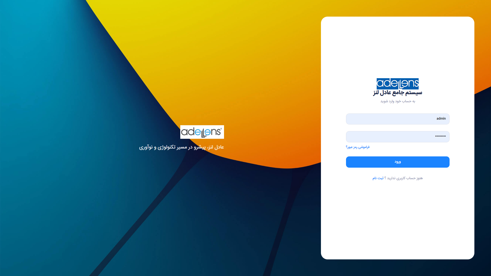
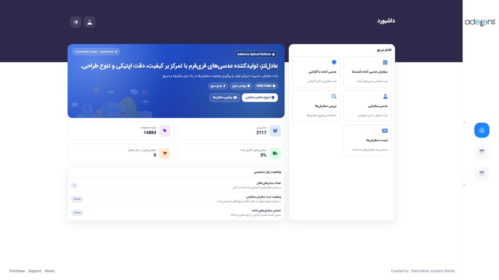
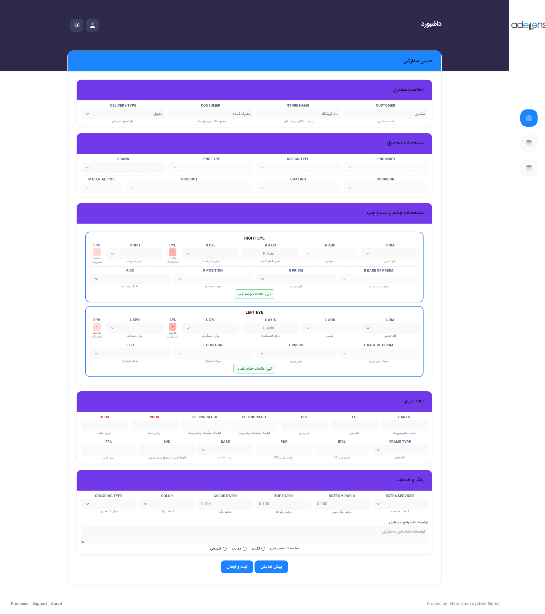
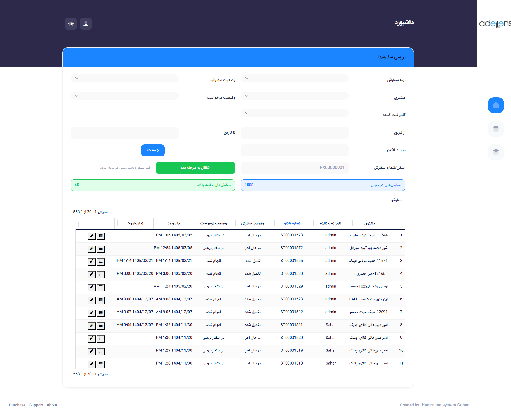
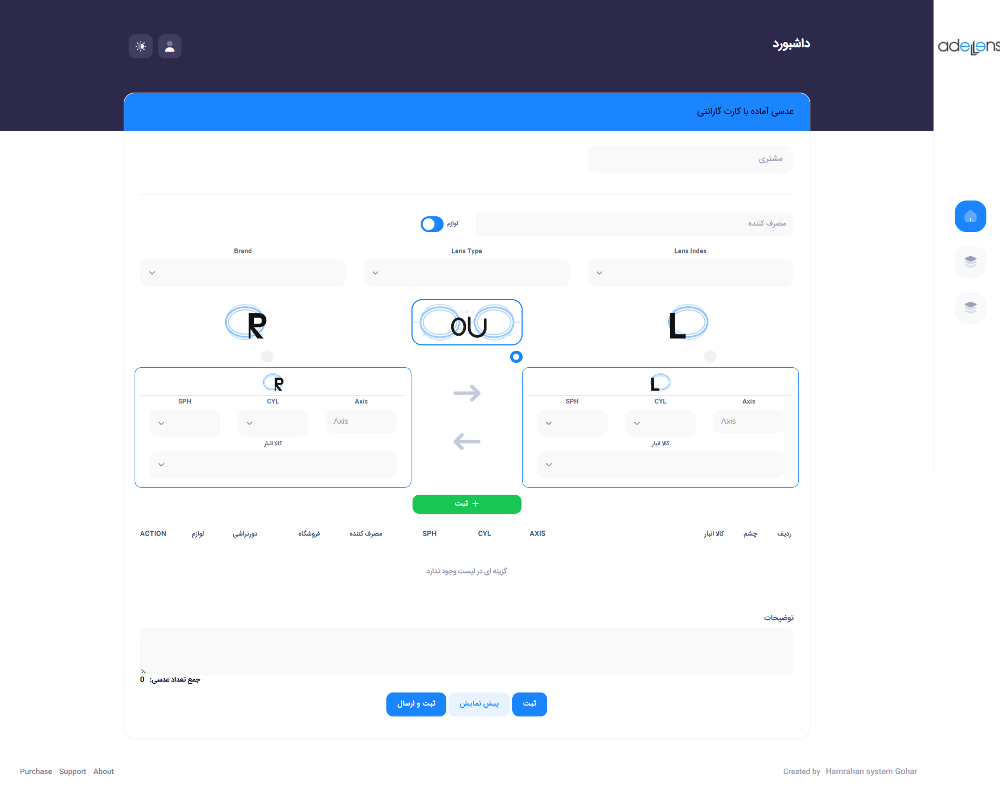
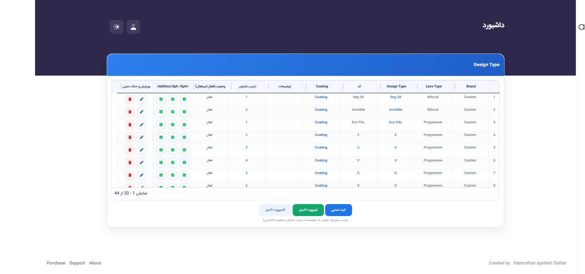

# AdelLens Ordering Portal

A portfolio-ready ASP.NET Core MVC application for optical lens ordering, workflow tracking, and custom lens request management.

## Overview

AdelLens Ordering Portal is a business-oriented web application built for operational workflows around optical lens orders, custom requests, status tracking, and back-office configuration.

This repository is prepared as a public portfolio mirror of the same application shown in the screenshots. It includes a local sample database backup and PowerShell setup scripts so reviewers can run the full application on their own machine without any paid infrastructure.

## Key Features

- Custom lens ordering workflow
- Order listing, review, and request tracking
- Ready lens and warranty-related order handling
- Workflow-driven process progression
- Design type and operational master-data management
- Role-aware back-office structure
- Full local demo flow backed by SQL Server
- Optional lightweight review mode without a database

## Tech Stack

- .NET 8
- ASP.NET Core MVC
- Entity Framework Core
- SQL Server
- FluentMigrator
- Razor Views / Server-rendered UI
- Optional Redis-backed caching with in-memory fallback

## Quick Start

This project is easiest to run on Windows 10/11.

### 1. Install prerequisites

- .NET 8 SDK
- SQL Server Developer or SQL Server Express
- SQL Server Management Studio is optional

### 2. Restore the included sample database

From the repository root:

```powershell
.\scripts\Restore-AdelLensDemoDatabase.ps1
```

This restores [`database/HS_Adel_demo.BAK`](database/HS_Adel_demo.BAK) into a local database named `HS_Adel`.

If you already have a database with the same name and want to overwrite it:

```powershell
.\scripts\Restore-AdelLensDemoDatabase.ps1 -Force
```

### 3. Start the full application

```powershell
.\scripts\Start-AdelLensPortal.ps1
```

Default local URL:

- `https://localhost:7181/Account/Login`

### 4. Sign in with the sample local account

- Username: `admin`
- Password: `Admin123!`

## Manual Run

If you prefer running it without the helper scripts:

```powershell
$env:ConnectionStrings__Default="Data Source=localhost;Initial Catalog=HS_Adel;Integrated Security=True;Encrypt=False;TrustServerCertificate=True;Connect Timeout=60"
dotnet run --project "HamrahanSystem/HamrahanSystem.Presntation/HamrahanSystem.Presntation.csproj" --launch-profile https
```

Use [`HamrahanSystem/HamrahanSystem.Presntation/appsettings.Example.json`](HamrahanSystem/HamrahanSystem.Presntation/appsettings.Example.json) as the local configuration reference.

## Optional Lightweight Review Mode

For a fast UI-only walkthrough without SQL Server:

```powershell
.\scripts\Start-AdelLensReviewMode.ps1
```

Review URL:

- `http://localhost:5299`

## Local Setup Notes

- Redis is optional. The portfolio setup uses in-memory caching when `Infrastructure:UseRedis` is `false`.
- The full application path is the primary portfolio target. The lightweight review mode exists only as a convenience fallback.
- Detailed local setup notes are available in [`docs/setup/local-setup.md`](docs/setup/local-setup.md).

## Screenshots

### Login Page
Internal operator login screen for accessing the portal.



### Dashboard and Main Navigation
Main dashboard and navigation layout for accessing the core operational modules.



### Custom Lens Order
Custom lens ordering workflow with business-specific inputs and request handling.



### Order Review
Order tracking and review screen for monitoring submitted requests and their current status.



### Ready Lens with Warranty
Operational page for managing ready lens orders with warranty-related workflow support.



### Design Type Settings
Administrative configuration screen for managing design type definitions and related setup data.



## Repository Notes

- This repository is published as a portfolio-safe public mirror
- The included database backup is a local demo dataset for portfolio review
- Real infrastructure values and internal deployment details have been removed
- The UI remains primarily Persian because it reflects the original production-facing business workflow
- Portfolio-facing documentation and setup instructions are written in English

## Contribution Highlights

This portfolio version showcases work around:

- Running and validating the application locally
- Packaging a local SQL-backed demo for external reviewers
- Preparing a public GitHub-safe version of the project
- Improving setup clarity and demo readiness
- Fixing runtime issues discovered during testing

## CV / LinkedIn Summary

> Developed and prepared a portfolio-ready ASP.NET Core MVC portal for optical lens ordering, workflow tracking, and custom product request management, including a reproducible local demo setup backed by SQL Server.
